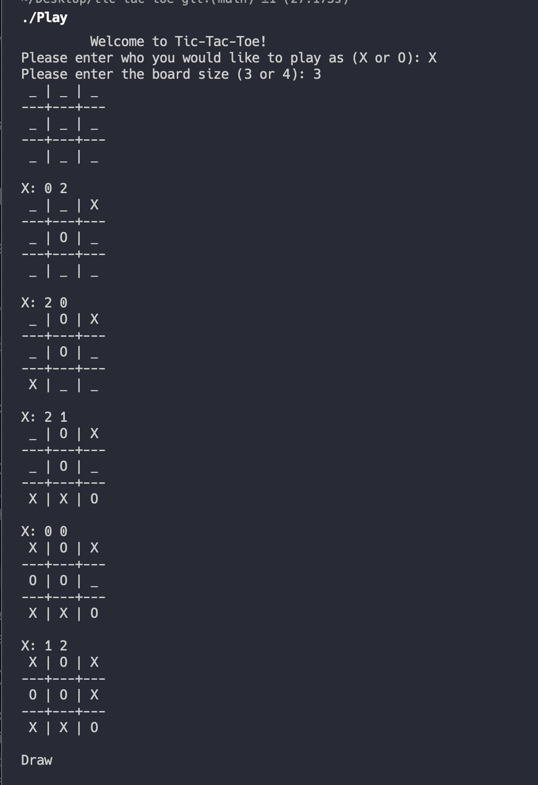
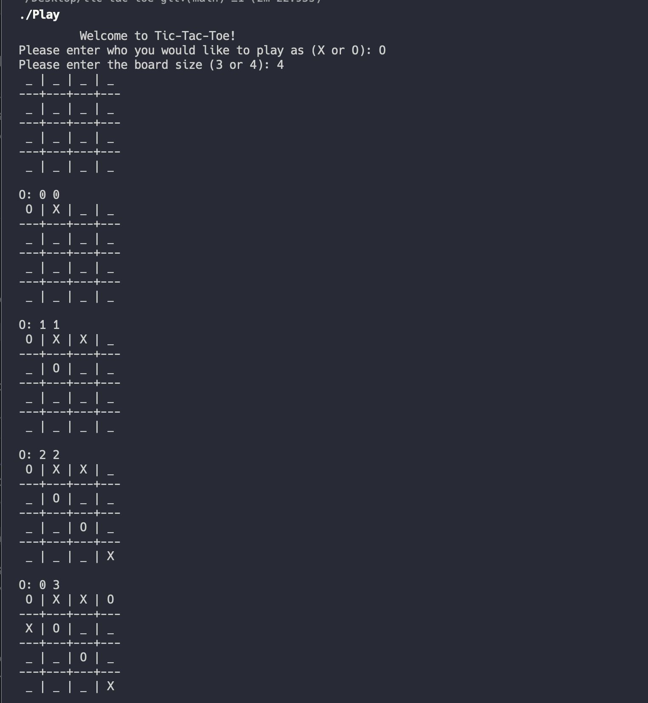

# Tic-Tac-Toe
Play against an unbeatable Tic-Tac-Toe algorithm using minimax!

## Overview

This project is a command-line implementation of the classic Tic-Tac-Toe game,
where you can play against an unbeatable computer opponent. The computer
uses the Minimax algorithm to make optimal moves, ensuring that it will
always either win or the game will end in a draw (sorry to those 
competitive people out there!). 

## Gameplay

To play the game, you need to enter your move as two integer inputs representing
the row and column where you want to place your mark.(X or O). For example, to
place your mark in the top-left corner, you would input `0 0`, and to place it
in the middle, you would input `1 1`.The game continues until one player wins or
it's a draw.

## Implementation

The project is written in C and focuses on efficient memory allocation and
deallocation to minimize resource usage. The minimax algorithm is used to determine
the computer's moves, ensuring a high level of difficulty for human players.

### Memory Allocation and Deallocation

Memory is allocated responsibly to avoid memory leaks. When a game is completed, 
all dynamically allocated memory is freed to ensure clean and efficient resource
management.

## Getting Started

Follow these steps to get started with the Tic-Tac-Toe game:

1. Clone the repository to your local machine:

 ``git clone https://github.com/ccrawford4/tic-tac-toe.git``

2. Navigate to the project directory: 
  ``cd tic-tac-toe``

3. Compile the code using the provided ``Makefile``. If you don't have 
[GCC](https://gcc.gnu.org/install/) or [Make](https://www.gnu.org/software/make/) installed
then do that.
   To perform the compilation just type: ``$ make`` into your command line.

4. Run the game: 
  ``$ ./Play``

5. Follow the on-screen instructions to play the game. Input your moves as row and column integers.

6. Cleanup (Optional)

    If you want to remove the compiled output files and to clean up your
    directory, you can use the collowing command:
    ``make clean``
    This will remove any generated object files and executables.

## Example Gameplay: 

;

;
